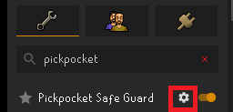
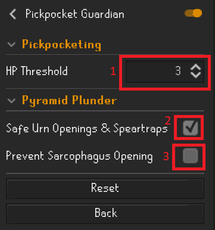

# Pickpocket Guardian plugin
This plugin is intended to be used to help prevent deaths while pickpocketing by preventing the "Pickpocket" action from being performed when at or below the specified HP threshold.

## Using the Pickpocket Guardian
The first step is to download the Pickpocket Guardian plugin from the Runelite Plugin Hub.

In your installed plugins, you should see "Pickpocket Guardian" appear in the Runelite sidebar. Click on the cog wheel to open up the settings.
 

Once in the settings, adjust the HP Threshold value to your desired amount. When AT or BELOW the set value, the plugin will prevent you from pickpocketing and display a message to eat food. It is recommended to set this value to whatever the NPC hits that you are pickpocketing. The default value is "3" for protection from master farmer and ardy knight deaths.
 

## Help and Feedback
If you are having any problems with the Pickpocket Guardian, or have any feedback on how to make it better, please [create an issue](https://github.com/Orrezon/PickpocketGuardian/issues/new) within Github and provide details.

## Support Me
If you would like to support me, and are able to, you can do so by subscribing or donating to my [Twitch](https://www.twitch.tv/batonpassgaming). Thank you!